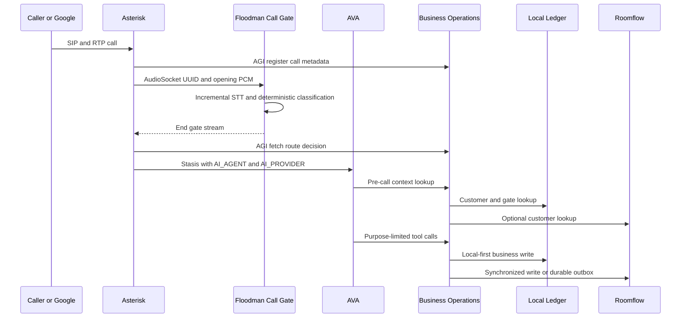

# Architecture

## Design goals

The system is built around five rules:

1. Telephone routing must remain deterministic when the model is uncertain.
2. Customer information must survive a Roomflow, calendar, carrier, or AI-provider outage.
3. Sensitive actions require server-side verification and narrow tools.
4. Outbound eligibility is a policy decision, not a language-model decision.
5. Every call and business mutation must be traceable through stable call IDs and idempotency keys.

## Runtime services

The single container runs four supervised processes:

| Process | Function |
|---|---|
| Asterisk | SIP, RTP, inbound dialplan, ARI, AMI, transfer routes |
| Floodman control plane | FastAPI, call gate, local ledger, dashboard, Roomflow adapter, outbound worker |
| AVA local AI server | Optional local STT, LLM, and TTS services |
| AVA voice engine | ARI/Stasis sessions, conversation pipelines, tools, call history |

The local call gate is part of the control-plane process and listens on `127.0.0.1:9019` from the generated Asterisk dialplan.

## Pinned AVA compatibility layer

The image checks out AVA at the exact commit recorded in the Dockerfile. Before dependencies are installed, `scripts/patch_ava.py` applies a deterministic compatibility patch to AVA’s pre-call and in-call generic HTTP tools. Dynamic values used in JSON body templates are encoded as JSON string content so customer names, property addresses, notes, and other fields containing quotes, backslashes, tabs, or line breaks cannot corrupt the request body.

The patch is idempotent and checks for exact upstream source structures. A changed AVA source layout stops the image build and requires review instead of applying a fuzzy patch to unknown code.

## Inbound state path



The opening AudioSocket is not transferred to another phone leg. Asterisk remains on the same channel. This avoids a second carrier leg and keeps the route change inside the PBX.

## Call gate state machine

```text
REGISTERED
  -> LISTENING
      -> READY                  direct customer
      -> ANNOUNCEMENT
          -> WAITING_FOR_HUMAN
              -> READY          Google forwarded customer
              -> TIMEOUT        safe ordinary-service fallback
      -> READY                  Google automated business call
      -> SECURITY_BLOCK         suspicious Google claim
      -> FAILED                 safe ordinary-service fallback
```

The gate has a maximum duration. It cannot trap a caller indefinitely. Any internal error produces a normal inbound-agent route.

## Data consistency

Business writes use this order:

1. Validate and normalize the request.
2. Write the customer, property, lead, appointment, invoice, callback, or upload to local SQLite.
3. Attempt the mapped Roomflow operation.
4. On a disabled integration, missing endpoint, timeout, or remote failure, add the mutation to `integration_outbox`.
5. Replay the outbox with the same idempotency key.

This makes the local ledger an operational safety net while allowing Roomflow to remain the preferred long-term system of record.

## Billing privacy boundary

Billing tools use a server-side `verification_sessions` table. The AI must call the verification tool with approved account facts. A successful session is tied to both `call_id` and `customer_id` and expires after a configured interval.

The billing summary returns:

- Invoice identifier
- Invoice number
- Status
- Amount due
- Currency
- Due date
- Whether a payment link exists

It does not return the payment URL in the spoken summary. Payment-link delivery uses a separate tool and never accepts payment-card or bank-account data.

## Outbound path

```mermaid
flowchart LR
    Source[Roomflow or admin campaign] --> Job[(Outbound job)]
    Job --> Consent[Consent and request validation]
    Consent --> Suppression[Suppression categories]
    Suppression --> External[DNC and reassignment attestations]
    External --> Time[Customer-local calling window]
    Time --> Frequency[Attempt and live-contact caps]
    Frequency --> AMI[Asterisk AMI originate]
    AMI --> Agent[Purpose-specific AVA agent]
    Agent --> Outcome[Disposition and Roomflow sync]
```



Every eligibility check is repeated immediately before dialing. A job created while eligible can still be blocked later because of an opt-out, revoked consent, expired DNC check, quiet hours, or frequency cap.

## Failure behavior

| Failure | Behavior |
|---|---|
| Gate STT unavailable | Gate startup logs an error; dialplan bypasses or fails open to inbound AVA |
| Classifier uncertain | Ordinary Floodman inbound agent |
| AVA provider unavailable | Asterisk provider-failure transfer destination |
| Roomflow unavailable | Local write plus durable outbox |
| Calendar unavailable | Local provisional availability |
| AMI unavailable | Outbound job retries or fails without duplicate dialing |
| AI tool timeout | Safe message and callback option |
| Upload link invalid | HTTP 410 without disclosing token details |
| Billing not verified | No account details, callback offered |
